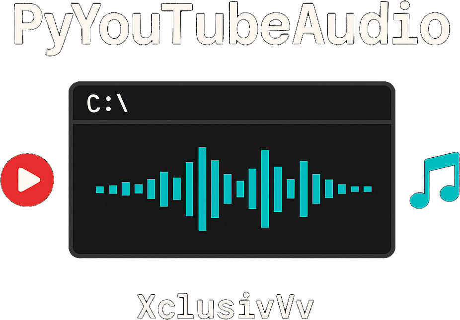

<p align="center">
  
</p>


<p align="center"><i>
A terminal-based YouTube audio streamer with hotkeys, ASCII visualizer, and blazing-fast search — built for Windows.
</i></p>

---

## 🚀 Features

- 🎧 Stream audio from YouTube directly in your terminal
- 🎨 Colorful interface using `colorama`
- ⌨️ Pause / Resume / Quit with hotkeys (`P`, `Q`)
- 🔁 Loop mode support (`L`)
- 💡 Dark mode toggle (`D`)
- 📜 Playback history and replay
- 📊 ASCII animated audio visualizer
- ⚡ Blazingly fast YouTube search via `yt-dlp`

---

## 🛠 Installation

> 💡 Make sure Python 3.9+ and pip are already installed.

### 1️⃣ Clone the Repo
```
git clone https://github.com/XclusivVv/PyYouTubeAudio.git
cd PyYouTubeAudio
```

### 2️⃣ Install Requirements
```
pip install -r requirements.txt
```

### 3️⃣ Install VLC Media Player

* Download from: https://www.videolan.org/vlc/
* Ensure VLC is added to your system PATH, or is installed in the default location.

---

## 📗 Usage
```
python PyYouTubeAudio.py
```
You'll be prompted for a YouTube search term. Example:
```sql
Enter search query: chill lofi
```
Then you'll see:
```scss
[1] Lofi Beats for Focus
[2] Chillhop Essentials
...
Enter number (1-5):
```
🎹 Once audio starts, control it with your keyboard:
* `P` – Pause / Resume
* `Q` – Quit playback
* `L` – Loop current track
* `D` – Toggle dark mode

An animated ASCII visualizer will dance to your music!

---

## 🗂 Project Structure
```bash
PyYouTubeAudio/
├── youtube.py           # Main script
├── README.md            # This file
├── requirements.txt     # Python dependencies
└── LICENSE              # Open-source license
```

---

* 🔄 Upcoming Ideas
* 🕘 Playback history & replay system
* 🔁 Toggleable loop mode
* 🌘 Dark mode enhancements
* 📃 Playlist & queue support
* 💬 Discord Rich Presence
* 📸 Screenshot/GIF visual preview

---

## 🙌 Contributions Welcome

Feel like improving the interface, adding features, or making the audio smoother? Pull requests and suggestions are very welcome!

---

## 📄 License

MIT License © 2025 XclusivVv

--- 

## 🙏 Credits

* [yt-dlp](https://github.com/yt-dlp/yt-dlp) — Fast YouTube downloader backend
* [python-vlc](https://pypi.org/project/python-vlc/) — Media playback
* [colorama](https://pypi.org/project/colorama/) — Colored terminal output

---

## 🔗 Let's Connect

Open an issue or feature request and let’s make this cooler together!
Star ⭐ the repo if you enjoy it!